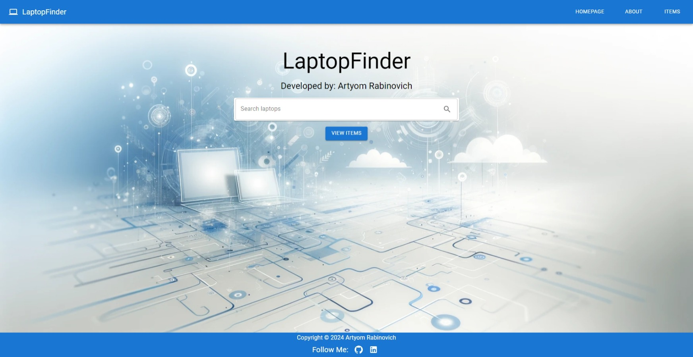
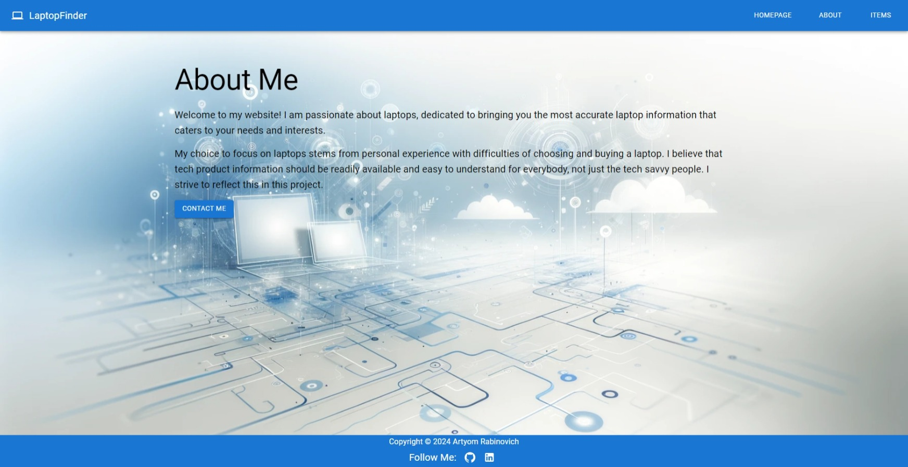

# LaptopFinder

## Introduction

LaptopFinder is a web application for comparing and reviewing laptops. Developed by Artyom Rabinovich, it aims to provide users with an intuitive and comprehensive platform to find laptops that best suit their needs.

## Table of Contents

- [Installation](#installation)
- [Usage](#usage)
- [Features](#features)
- [Dependencies](#dependencies)
- [Configuration](#configuration)
- [Documentation](#documentation)
- [Troubleshooting](#troubleshooting)

## Installation

Since this project was bootstrapped with Create React App, you can install it by cloning the repository and running the following commands:

git clone https://github.com/ArtyomRabinovich/final-project-app.git

cd final-project-app
npm install

npm start

This runs the app in development mode.
Open http://localhost:3000 to view it in the browser.

## Usage

Upon launching the app, you'll be greeted with a search bar on the homepage where you can start your laptop search. Navigate through the site to view items, see detailed information, or learn more about the project.

## Features

- Laptop Listings: Browse through a variety of laptops.
- Search and Filter: Find the laptop you're looking for with ease.
- Laptop Details: View detailed information about each laptop.
- 404 Page: Custom error page for non-existent routes.
- Responsive Design: Built with Material-UI for a responsive layout.
## Screenshots

### Homepage

### About Page

### Items Listing

### Laptop Details

### Edit

### 404 Page

## Dependencies

- React
- React Router Dom
- Material-UI
- LaptopApi service for fetching laptop data

## Configuration

No additional configuration is needed to run the project in development mode.

## Documentation

Refer to Create React App documentation to understand the underlying structure and scripts available.

[Create React App documentation](https://create-react-app.dev/docs/getting-started/)

Material-UI documentation will help you understand the UI components used.

[Material-UI documentation](https://mui.com/material-ui/getting-started/)

## Troubleshooting

If you encounter any issues, first ensure all npm dependencies are correctly installed. Check the console for any errors that might indicate missing modules.

Common issues related to Create React App and their resolutions can be found here:

[Create React App Troubleshooting](https://create-react-app.dev/docs/troubleshooting/)
